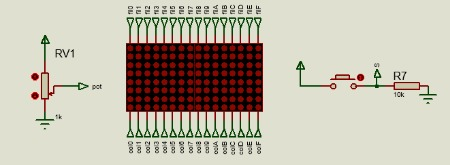
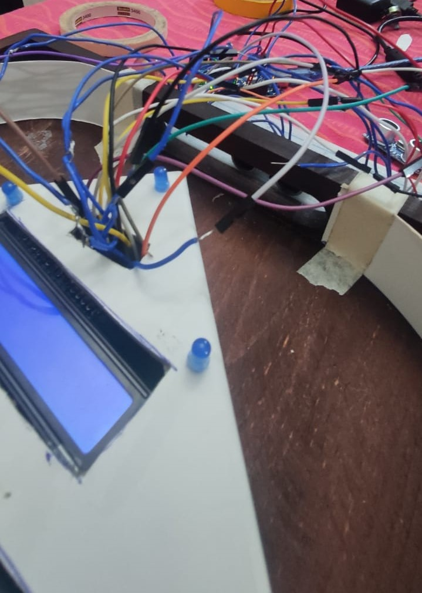
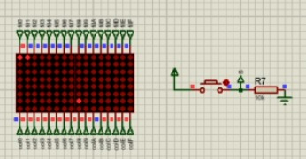
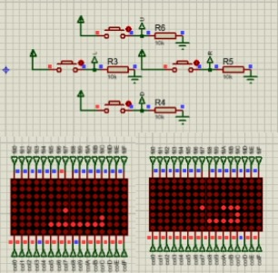
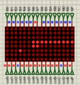
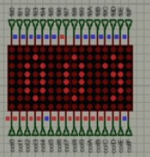

<table width="100%">
    <tr>
        <td width="50%"  scope="col">
            Universidad de San Carlos de Guatemala<br>
            Facultad de Ingeniería<br>
            Arquitectura de Computadores y Ensambladores 1<br>
            Sección "A"<br>
            Segundo Semestre 2023<br>
            Grupo 2
        </td>
        <td width="10%" align="right" valign="top">
            
        </td>
    </tr>
</table>

<h1 align="center">
    Práctica 1<br>Manual de Usuario
</h1>

## Explicación del juego
El juego se basa en el clásico juego "Snake", consiste en que el jugador o usuario controla una criatura semejante a una serpiente, que vaga alrededor de un plano delimitado, su principal función es recoger alimentos y tratar de evitar golpear su propia cola o las paredes que rodean el área de juego. 

Modo de juego:
* Cada vez que la serpiente come una pieza de comida la cola crece más.
* El usuario controla la dirección de la cabeza de la serpiente, es decir, puede dirigirse hacia arriba, abajo, izquierda y derecha, por lo tanto, el cuerpo de la serpiente sigue esta trayectoria.
* El jugador no puede detener el movimiento de la serpiente mientras el juego esté en marcha.
* Antes de iniciar el juego, podrá seleccionar la velocidad de la serpiente, ésta se mostrará en la pantalla, puede cambiar con los botones de arriba y abajo, siendo 1 la opción más lenta y 4 la más rápida.
* Cuando la serpiente muera se mostrará en pantalla el mensaje GAME OVER y la puntuación final la cual consiste en la cantidad de alimento que logró comer.


## Explicación del juego en el Arduino
El juego consta de 2 matrices LED de 8x8 cuyo funcionamiento reside en mostrar tanto el tablero como un mensaje en movimiento, dicho mensaje se muestra de izquierda a derecha al iniciar el juego. 

<p align="center">
        
</p>

Antes de iniciar el juego se mostrará el número “01”, el cual representa la velocidad de la serpiente, esta velocidad se puede modificar con los botones de arriba y abajo; mientras más alto sea el número, mayor será la velocidad de la serpiente.

<p align="center">
        
</p>


Inicio del juego: el juego iniciará una vez el jugador mantenga presionado el botón de start durante al menos 3 segundos. La serpiente puede aparecer en cualquier fila de manera aleatoria y también aparecerá en alguna de las columnas iniciales de los 2 displays.

<p align="center">
        
</p>

**Movimiento de la Serpiente**

* El tamaño de la serpiente al iniciar es de 2 puntos de la matriz.
* El movimiento será únicamente de un punto a un punto.
* Cada vez que la serpiente logra comerse algo crece en tamaño una posición y su velocidad aumenta un poco. 
* Si se presiona el botón Start para pasar a un estado de pausa y luego se vuelve a presionar para continuar el juego, la serpiente se mostrará en la posición en la que estaba antes de entrar en el estado de pausa.
* La serpiente se puede controlar mediante cualquiera de los 4 botones direccionales (arriba, abajo, izquierda, derecha).

<p align="center">
        
</p>

**Posicionamiento de Manzanas**

Inicialmente la manzana estará en una posición aleatoria dentro de la matriz, al momento de que la serpiente colisione con una manzana esta desaparecerá del tablero y aumenta el tamaño de la serpiente y nuevamente se generará una manzana en una nueva posición aleatoria.

**Game Over**

El juego terminará al momento de que la serpiente colisione con uno de los muros del tablero delimitado por las matrices de LEDs o al colisionar con sigo mismo. 

Al haber terminado la partida se mostrará el punteo que se ha obtenido durante el juego.

<p align="center">
        
        
</p>

<br>
<br>
<br>

<h1 align="center">
    Práctica 1<br>Manual Técnico
</h1>


## Métodos Generales
### Método pintarLed
* Enciende el LED en las coordenadas especificadas.
* Utilizado para mostrar elementos del juego en la matriz LED.
``` c++
void pintarled(int x, int y){
  if(x<8){
    digitalWrite(x+46,HIGH);
    digitalWrite(y,LOW);
    delay(1);
    digitalWrite(x+46,LOW);
    digitalWrite(y,HIGH);
  }else{
    driver.setLed(0,y,x-8,true);
  }
}
```

### Metodo printNumero
* Muestra el puntaje numérico en la matriz LED.
* Divide el puntaje en centenas, decenas y unidades y muestra los dígitos correspondientes.
``` c++
void printNumero(int n){
  int centenas = int(n/100);
  int decenas = int((n-centenas*100)/10);
  int unidades = int(n-centenas*100-decenas*10);

  for(int x = 0;x<4;x++){
    for(int y = 0;y<8;y++){
      if(numeros[centenas][y][x]){
        pintarled(x+1,y);
      }
    }
  }

  for(int x = 0;x<4;x++){
    for(int y = 0;y<8;y++){
      if(numeros[decenas][y][x]){
        pintarled(x+6,y);
      }
    }
  }

  for(int x = 0;x<4;x++){
    for(int y = 0;y<8;y++){
      if(numeros[unidades][y][x]){
        pintarled(x+11,y);
      }
    }
  }
}
```

## Métodos de Jugabilidad
### Método printSerpiente
* Muestra la serpiente en la matriz LED.
* Utiliza las coordenadas almacenadas en los arreglos serpienteX y serpienteY para mostrar la serpiente.
``` c++
void printSerpiente(){
  for(int i = 0; i<longitudSerpiente; i++){
    pintarled(serpienteX[i],serpienteY[i]);
  }
}
```

### Método printManzana
* Muestra la manzana en la matriz LED.
* Utiliza las coordenadas manzanaX y manzanaY para mostrar la manzana.
``` c++
void printManzana(){
  pintarled(manzanaX,manzanaY);
}
```

### Método moverSerpiente
* Actualiza la posición de la serpiente en función de su dirección actual.
* Maneja las colisiones con los bordes y consigo misma, lo que puede resultar en la pérdida del juego.
``` c++
void moverSerpiente(){
  int auxX;
  int auxY;

  for(int i = longitudSerpiente-1; i>=0; i--){
    serpienteX[i+1] = serpienteX[i];
    serpienteY[i+1] = serpienteY[i];
  }

  longitudSerpiente++;

  if(direccionActual == "up"){
    serpienteY[0]--;
  }else if(direccionActual == "down"){
    serpienteY[0]++;
  }else if(direccionActual == "left"){
    serpienteX[0]--;
  }else if(direccionActual == "right"){
    serpienteX[0]++;
  }

  xActual = serpienteX[0];
  yActual = serpienteY[0];

  if(xActual<0||xActual>15||yActual<0||yActual>7){
    perdio = true;
    Serial3.print(xActual);
    Serial3.print(", ");
    Serial3.println(yActual);
    Serial3.println("Perdio por colision con borde");
  }

  if(revisarColision(xActual,yActual,1)){
    perdio = true;
    Serial3.println("Perdio por colision consigo mismo");
  }
}
```

### Función revisarColision
* Verifica si hay colisiones entre las coordenadas (x, y) y la serpiente.
* Puede comenzar la búsqueda desde un índice específico (inicio) para verificar colisiones con segmentos anteriores de la serpiente.
``` c++
bool revisarColision(int x, int y, int inicio){
  for(int i = inicio; i<longitudSerpiente; i++){
    if(serpienteX[i] == x && serpienteY[i] == y){
      return true;
    }
  }
  return false;
}
```