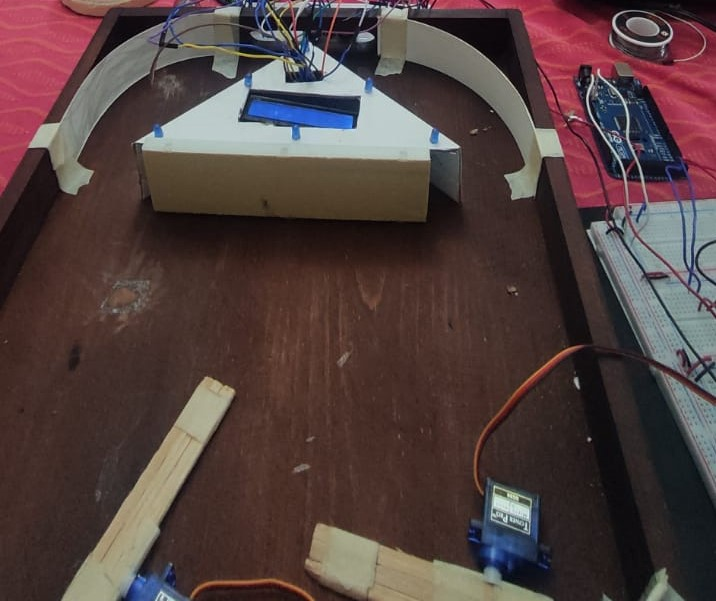

<table width="100%">
    <tr>
        <td width="50%"  scope="col">
            Universidad de San Carlos de Guatemala<br>
            Facultad de Ingeniería<br>
            Arquitectura de Computadores y Ensambladores 1<br>
            Sección "A"<br>
            Segundo Semestre 2023<br>
            Grupo 2
        </td>
        <td width="10%" align="right" valign="top">
            
        </td>
    </tr>
</table>

<h1 align="center">
    Práctica 2<br>Manual de Usuario
</h1>

## Explicación del juego
Pinball es un juego que se basa en el impulso de una bola en el interior de un tablero equipado con diversos componentes. El objetivo dentro del tablero es hacer pasar la mayor cantidad de veces la pelota por la parte superior
del cilindro del tablero para acumular puntos, sin que salga del terreno de juego.

Modo de juego:
* El objetivo dentro del tablero es hacer pasar la mayor cantidad de veces la pelota por la parte superior del cilindro del tablero. Al completar la acción varias veces permitirá al jugador avanzar de nivel y obtener así más puntos. Cada vez que se completen los LEDs, el usuario habrá obtenido el derecho de avanzar hacia un nivel superior.

* El menú contiene dos opciones: Nuevo juego y Puntajes
altos. 
Con el botón izquierdo se navega entre las opciones, mientras que el botón derecho se selecciona la opción elejida.

* Al seleccionar la opción de nuevo juego, se ingresa un pelota desde el exterior hacia el tablero y se inicia el juego, el jugador podrá operar, por medio de los botones, las paletas.


## Diseño del juego

El diseño del juego consiste en un tablero, que tiene un cilindro en la parte superior del mismo. En el cilindro se muestra una pantalla rodeada de LEDS.
En la parte inferior del tablero se pueden encontrar 2 paletas que funcionan como bloqueadores para que la pelota no salga del área de juego.

Fuera del área de juego, se encuentran los botones que permiten accionar las paletas o navegar por los menús que se presenten en la pantalla. Cada vez que se completen los LEDs, el usuario habrá obtenido el derecho de avanzar hacia un nivel superior.

<p align="center">
        
</p>

**Mecánica del Juego**

* Cuando se inicie el juego, se mostrará un mensaje de bienvenida, indicando también otros datos referentes a los desarrolladores del prototipo. Una vez mostrados todos los nombres, se redireccionará al menú principal.

* En la pantalla se deberá mostrará el nivel actual y la cantidad de vidas disponibles, en lavfila superior, y el puntaje actual, en la fila inferior.

* Las vidas se muestran por medio de pequeños círculos, las vidas disponibles serán círculos llenos y las vidas que se
han perdido será el contorno del círculo.

<p align="center">
        
</p>

**Puntajes**

* Al seleccionar la opción de puntajes, se hará un recorrido por los diez mejores puntajes que el sistema haya registrado. 
Para avanzar en este recorrido, se emplearán los botones exteriores. El botón izquierdo permitirá avanzar entre los registros y el botón derecho se usará para salir hacia el menú principal.


<br>
<br>
<br>

<h1 align="center">
    Práctica 2<br>Manual Técnico
</h1>


## Métodos Generales
### Método mostrarNombres
* Muestra el número de grupo y los integrandes en la pantalla LCD.
``` c++
void mostrarNombres() {
    lcd.print("Grupo #2");
    for (int i = 0; i < 4; i ++) {
        lcd.setCursor(0, 1);
        lcd.print(nombres[i]);
        delay(1000);
    }
}
```

### Método iniciarTrigger
* Inicia la secuencia del Trigger para comenzar a medir.
``` c++
void iniciarTrigger()
{
  digitalWrite(trig, LOW);
  delayMicroseconds(2);
 
  digitalWrite(trig, HIGH);
  delayMicroseconds(10);
 
  digitalWrite(trig, LOW);
}
```


### Método calcularDistancia
* Calcula la distancia en cm.
* Utiliza las ondas que envía y recibe el sensor para calcular la distancia deseada en las unidades deseadas.
``` c++
float calcularDistancia()
{
  unsigned long tiempo = pulseIn(echo, HIGH);
 
  float distancia = tiempo * 0.000001 * sonido / 2.0;
  Serial.print(distancia);
  Serial.print("cm");
  Serial.println();
  delay(500);
 
  return distancia;
}
```

### Método registrarPuntaje
* En este método se registran los puntajes de los jugadores
``` c++
void registrarPuntaje(unsigned long puntaje) {
    if (puntajes[9][1] == "") {
        for (int i = 0; i < 10; ++ i) {
            if (puntajes[i][1] == "") {
                puntajes[i][1] = String(puntaje);
                sort();
                return;
            }
        }
        return;
    }
    puntajes[9][1] = String(puntaje);
    sort();
}
```

### Método loop
* Realiza el movimiento de los servos.
* Recibe las señales emitidas por los botones y las envía a la pantalla LCD, dependiendo del tipo de acción que se esté realizando o en cuál menú se encuentre el jugador. 
``` c++
void loop() {
  iniciarTrigger();
  float distancia = calcularDistancia();
  if (distancia > tope)
  {
    digitalWrite(led, LOW);
  }
 else if (distancia < tope)
  {
    digitalWrite(led, HIGH);
   }
  
     switch (estado) {
    case MENSAJE:
        lcd.clear();
        mostrarNombres();
        estado = Estado::MENU;
        break;
    case MENU:
        lcd.clear();
        lcd.print(">");
        lcd.setCursor(2, 0);
        lcd.print("NUEVO JUEGO");
        lcd.setCursor(2, 1);
        lcd.print("PUNTAJES ALTOS");
      	opcion = 0;
      	opcionI = 1;
        LOOP
        {
            // SUBE / BAJA
            if (!digitalRead(PULSADOR1)) {
                pulsacion1 = false;
            }
            if (!pulsacion1 && digitalRead(PULSADOR1)) {
                pulsacion1 = true;
                opcionI = (opcionI + 1) % 2;
                opcion = (opcion + 1) % 2;
                lcd.setCursor(0, opcionI);
                lcd.print(" ");
                lcd.setCursor(0, opcion);
                lcd.print(">");
            }
            // SELECCIONAR
            if (!digitalRead(PULSADOR2)) {
                pulsacion2 = false;
            }
            if (!pulsacion2 && digitalRead(PULSADOR2)) {
                pulsacion2 = true;
                // ELECCION
                if (opcion == 0) {
                    estado = Estado::JUEGO;
                    break;
                }
                else if (opcion == 1) {
                    estado = Estado::PUNTAJES;
                    break;
                }
            }
        }
        break;
    case JUEGO:
        lcd.clear();
        lcd.print("JUGANDO...");
        puntos = 0;
        LOOP {
            // LADO IZQUIERDO
            if(!digitalRead(PULSADOR1)) {
                tirado1 = false;
            }
            if(!tirado1 && digitalRead(PULSADOR1)) {
              	lcd.setCursor(0, 1);
              	lcd.print("IZQ");
                pulsacion1 = true;
                tirado1 = true;
                lastTime1 = millis();
            }
            if(pulsacion1) {
                if(!abierto1) {
                    palancaIzq.write(60);
                }
                if(!abierto1 && millis() - lastTime1 >= 300) {
                    lastTime1 = millis();
                    abierto1 = true;
                }
                if(abierto1) {
                    palancaIzq.write(0);
                }
                if(abierto1 && millis() - lastTime1 >= 300) {
                    lastTime1 = millis();
                    abierto1 = false;
                    pulsacion1 = false;
                }
            }
            // LADO DERECHO
            if(!digitalRead(PULSADOR2)) {
                tirado2 = false;
            }
            if(!tirado2 && digitalRead(PULSADOR2)) {
              	lcd.setCursor(0, 1);
              	lcd.print("DER");
                pulsacion2 = true;
                tirado2 = true;
                lastTime2 = millis();
            }
            if(pulsacion2) {
                if(!abierto2) {
                    palancaDer.write(120);
                }
                if(!abierto2 && millis() - lastTime2 >= 300) {
                    lastTime2 = millis();
                    abierto2 = true;
                }
                if(abierto2) {
                    palancaDer.write(180);
                }
                if(abierto2 && millis() - lastTime2 >= 300) {
                    lastTime2 = millis();
                    abierto2 = false;
                    pulsacion2 = false;
                }
            }
        }
        break;
    case PUNTAJES:
        lcd.clear();
        mostrarPuntaje();
        posicion = 0;
        LOOP {
            // AVANZA
            if (!digitalRead(PULSADOR1)) {
                pulsacion1 = false;
            }
            if (!pulsacion1 && digitalRead(PULSADOR1)) {
                pulsacion1 = true;
                posicion = (posicion + 1) % 10;
                mostrarPuntaje();
            }
            // SELECCIONAR
            if (!digitalRead(PULSADOR2)) {
                pulsacion2 = false;
            }
            if (!pulsacion2 && digitalRead(PULSADOR2)) {
                pulsacion2 = true;
                estado = Estado::MENU;
                break;
            }
        }
        break;
    }
}

```


## Métodos para la Jugabilidad


### Método loop
* 
``` c++
void loop() {
  digitalWrite(TRIG, HIGH);
  delayMicroseconds(10);
  digitalWrite(TRIG, LOW);
  DURACION = pulseIn(ECO, HIGH);
  DISTANCIA = DURACION / 58.2;
  Serial.println(DISTANCIA);
  
  if (DISTANCIA <= 20 && DISTANCIA >= 0) {
    if (estado == APAGADO) {
      estado = ENCENDIDO;
      encenderSiguienteLed();
      pts += incremento;
      lcd.setCursor(0, 1);
  	  lcd.print(pts);
    }
  } else {
    estado = APAGADO;
  }
  
  if (encendidos == 6) {
    delay(200);
  	apagarLeds();
  }
}
```
